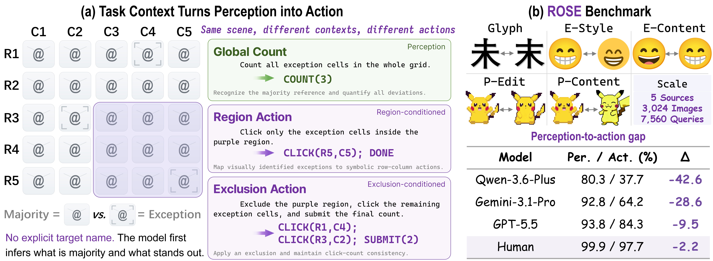

<div align="center">

# ROSE: Benchmarking the Perception-to-Action Gap in Multimodal Models

### Reference-conditioned Oddity and Symbolic Execution

**Can a multimodal model turn the same visual evidence into the exact action required by the current task context?**

[](https://xbdxwyh.github.io/ROSE-v0.1/)
[](https://arxiv.org/abs/2606.19965)
[](https://huggingface.co/datasets/sysuwyh357/ROSE-v0.1)
[](LICENSE)
[](https://www.python.org/)

**Yihao Wang, Zijian He, Jie Ren, Keze Wang**

</div>

<p align="center">
  
</p>

---

## Overview

Multimodal large language models (MLLMs) are increasingly expected to act on visual information, yet the same scene may require different actions under different task contexts. ROSE asks a focused question: **can a model convert a visual interpretation into the exact symbolic action required by the current context while the underlying scene remains unchanged?**

ROSE, short for **Reference-conditioned Oddity and Symbolic Execution**, is a controlled benchmark for context-conditioned visual action. Each scene presents a grid of visually similar elements without an explicit target name. The model must infer the scene-internal majority reference, identify sparse exception cells, and then read out the same visual evidence under different task contexts.

The benchmark holds the visual scene fixed while varying:

- the permitted region;
- the required output operation;
- whether the model should count, click, exclude, or abstain;
- whether the returned coordinates and submitted count are mutually consistent.

This design supports controlled within-scene comparisons between compact counting readouts and exact coordinate-level actions.

---

## Highlights

- **Scene-coupled evaluation:** multiple tasks are derived from the same visual scene, enabling controlled comparisons between perception-oriented and action-oriented behavior.
- **Implicit visual reference:** the target class is not named in text; the model must infer what is normal and what stands out from the image itself.
- **Context-conditioned action:** numeric regions, visual regions, and exclusion constraints change which inferred exception cells are actionable.
- **Exact symbolic protocol:** answers are automatically scored through `COUNT`, `CLICK`, `DONE`, and `SUBMIT` outputs.
- **Diagnostic controls:** global-click and matched local count-to-click bridges separate output validity, coordinate localization, and context-conditioned selection.

---

## Benchmark Design

### Visual sources

ROSE v0.1 contains five controlled visual sources. Each source provides majority/exception pairs that are fine-grained, human-visible, and rendered under matched conditions.

| Subset | Controlled visual source | Description |
|---|---|---|
| `ROSE-ChineseGlyph` | Confusable characters, same verified font | Distinct but visually confusable Chinese characters rendered under a verified font pool. |
| `ROSE-EmojiStyle` | Same emoji, different rendering providers | The semantic emoji identity is fixed while provider-specific rendering style changes. |
| `ROSE-EmojiContent` | Related emoji identities, shared rendering style | Visually related emoji contents are rendered in a shared style. |
| `ROSE-PixelEdit` | Same pixel-art asset, localized edit | A localized modification is introduced into the same source image. |
| `ROSE-PixelContent` | Related but distinct pixel-art assets | Two visually related but distinct pixel-art assets are paired. |

### Coupled task templates

Each scene produces five coupled tasks. T1 and T2 provide counting-oriented probes, while T3--T5 test increasingly explicit context-sensitive actions.

| Template | Name | Context | Required output |
|---|---|---|---|
| `T1_COUNT_GLOBAL` | Global counting (`G-Cnt`) | Whole grid | `COUNT(n)` |
| `T2_COUNT_LOCAL_NUMERIC` | Local counting (`L-Cnt`) | Numeric row/column/rectangle region | `COUNT(n)` |
| `T3_CLICK_LOCAL_NUMERIC` | Local clicking (`L-Clk`) | Numeric row/column/rectangle region | `CLICK(...); DONE` |
| `T4_CLICK_VISUAL_REGION` | Visual-region clicking (`V-Clk`) | Highlighted region in the image | `CLICK(...); DONE` |
| `T5_CLICK_COUNT_EXCLUSION` | Exclusion clicking with count submission (`Excl-CS`) | Outside a text-specified excluded region | `CLICK(...); SUBMIT(n)` |

### Output grammar

ROSE uses an automatically verifiable symbolic protocol:

```text
COUNT(n)
CLICK(Rr,Cc); ...; DONE
CLICK(Rr,Cc); ...; SUBMIT(n)
```

Rows and columns are 1-indexed. Click order is ignored, but the predicted coordinate set must match the ground-truth set exactly. Malformed outputs, out-of-grid coordinates, duplicate clicks, region-rule violations, and inconsistent click-count submissions are diagnosed by the evaluator.

---

## Dataset Statistics

ROSE v0.1 contains **1,512 scenes**, **3,024 rendered images**, and **7,560 task instances**. Each scene produces five task instances and two renderings: an uncued base image and a cue-augmented image used for visual-region clicking.

The split is performed at the scene level, so all task variants and renderings from the same scene remain in the same split.

| Subset | Scenes | Images | Dev tasks | Test tasks |
|---|---:|---:|---:|---:|
| ChineseGlyph | 412 | 824 | 555 | 1,505 |
| EmojiStyle | 300 | 600 | 395 | 1,105 |
| EmojiContent | 300 | 600 | 395 | 1,105 |
| PixelEdit | 300 | 600 | 395 | 1,105 |
| PixelContent | 200 | 400 | 260 | 740 |
| **Total** | **1,512** | **3,024** | **2,000** | **5,560** |

---

## Main Results

ROSE is highly solvable by humans but remains challenging for current MLLMs. A trained human annotator reaches **98.8% average PASS**, while the evaluated models range from **14.3%** to **92.2%** average PASS.

### Primary ROSE test results

| Model | G-Cnt | L-Cnt | L-Clk | V-Clk | Excl-CS | Glyph | Emoji | Pixel | Avg. | VALID |
|---|---:|---:|---:|---:|---:|---:|---:|---:|---:|---:|
| Qwen3-VL-Flash | 47.7 | 21.6 | 1.3 | 0.5 | 0.7 | 15.0 | 14.9 | 13.6 | 14.3 | 86.6 |
| Qwen3-VL-Plus | 66.4 | 30.6 | 4.1 | 5.7 | 3.2 | 21.8 | 24.0 | 20.1 | 22.0 | 95.5 |
| Qwen3.6-Plus | 80.3 | 65.3 | 39.5 | 37.7 | 28.9 | 48.4 | 48.0 | 53.6 | 50.3 | 99.9 |
| Claude-Sonnet-4.6 | 62.1 | 21.6 | 9.8 | 20.6 | 4.5 | 28.5 | 25.0 | 20.1 | 23.7 | 61.3 |
| Claude-Opus-4.8 | 64.0 | 21.2 | 9.8 | 21.4 | 4.9 | 30.2 | 25.2 | 20.4 | 24.3 | 62.7 |
| GLM-4.6V | 60.7 | 30.8 | 5.0 | 4.5 | 2.5 | 19.1 | 22.4 | 19.9 | 20.7 | 98.8 |
| GLM-5V-Turbo | 64.2 | 56.9 | 20.6 | 21.4 | 6.1 | 37.5 | 34.5 | 31.3 | 33.8 | 99.5 |
| Gemini-3.1-Pro | 92.8 | 93.9 | 75.4 | 64.2 | 70.4 | 67.6 | 84.5 | 80.1 | 79.4 | 93.4 |
| GPT-5.5 | 93.8 | 97.0 | 93.6 | 84.3 | 92.5 | 87.4 | 94.8 | 92.2 | 92.2 | 100.0 |
| Human | 99.9 | 100.0 | 98.8 | 97.7 | 95.8 | 99.8 | 97.5 | 99.8 | 98.8 | - |

`Glyph` denotes `ROSE-ChineseGlyph`; `Emoji` averages `ROSE-EmojiStyle` and `ROSE-EmojiContent`; `Pixel` averages `ROSE-PixelEdit` and `ROSE-PixelContent`. `Avg.` is the equal macro average over the five original visual subsets.

### Perception-to-action gap

Across nine recent MLLMs, ROSE reveals a strongly model-dependent counting-to-action gap. Counting-oriented tasks remain substantially easier than region-conditioned coordinate actions for many models. The largest observed drop is **44.5 percentage points** from Counting Avg. to Action Avg.

The gap persists even under paired controls where the same model has already returned the correct count. This indicates that the bottleneck is not only detecting that some cells are visually different; many failures occur when the model must rebind the inferred exception set to the current region and express it as an exact action.

### Global count-to-click bridge

The global-click bridge inserts a full-grid coordinate action between global counting and visual-region clicking:

```text
G-Cnt  ->  G-Clk  ->  V-Clk
count      global      region-conditioned
           coordinates coordinates
```

| Model | G-Cnt | G-Clk | G-Clk† | V-Clk | Card | Loc.\|Card | C-F1 | ΔC→G | ΔG→V |
|---|---:|---:|---:|---:|---:|---:|---:|---:|---:|
| Qwen3.6-Plus | 80.3 | 67.1 | 73.1 | 37.7 | 86.0 | 78.0 | 76.4 | -13.2 | -29.4 |
| Gemini-3.1-Pro | 92.8 | 86.5 | 90.5 | 64.2 | 91.2 | 94.8 | 89.7 | -6.3 | -22.3 |
| GPT-5.5 | 93.8 | 91.8 | 96.1 | 84.3 | 94.9 | 96.7 | 95.4 | -2.0 | -7.5 |

`G-Clk†` denotes global-click PASS restricted to scenes where global counting is correct. `Card` measures exact clicked-cardinality accuracy, and `Loc.|Card` measures exact coordinate localization conditioned on correct cardinality.

### Matched local count-to-click bridge

The matched local bridge holds the **same image, same numeric region, and same regional target set** fixed, changing only the required output from `COUNT(n)` to coordinate-level `CLICK` actions.

| Model | Case | mL-Cnt | L-Clk | L-Clk† | Fail† |
|---|---|---:|---:|---:|---:|
| Qwen3.6-Plus | Overall | 63.2 | 39.5 | 52.7 | 47.3 |
| Qwen3.6-Plus | Zero | 67.5 | 12.7 | 18.3 | 81.7 |
| Qwen3.6-Plus | Partial | 55.8 | 47.3 | 67.7 | 32.3 |
| Qwen3.6-Plus | All | 84.7 | 73.8 | 78.7 | 21.3 |
| GPT-5.5 | Overall | 96.7 | 93.6 | 95.8 | 4.2 |
| GPT-5.5 | Zero | 99.2 | 92.8 | 93.6 | 6.4 |
| GPT-5.5 | Partial | 95.5 | 93.7 | 96.8 | 3.2 |
| GPT-5.5 | All | 94.0 | 91.0 | 94.0 | 6.0 |

`L-Clk†` denotes local-click PASS conditioned on correct independently queried matched local counting, and `Fail† = 100 - L-Clk†`.

---

## Repository Structure

```text
ROSE-v0.1/
├── README.md
├── LICENSE
├── requirements.txt
├── demo/
│   ├── run_qwen.py
│   ├── evaluate_rose.py
│   └── outputs/                      # generated files; ignored by Git
└── analysis/
    ├── README.md
    ├── rose_analysis_utils.py
    ├── analyze_scene_consistency.py
    ├── evaluate_global_click_bridge.py
    ├── evaluate_matched_local_count_bridge.py
    └── data/
        ├── global_click/
        │   └── metadata_test.jsonl
        └── matched_local_count/
            └── metadata_test.jsonl
```

The two derived bridge tasks are released as **metadata only**. Their image paths point to the canonical images in the main Hugging Face dataset, so image files are not duplicated in this repository.

---

## Installation

```bash
git clone https://github.com/xbdxwyh/ROSE-v0.1.git
cd ROSE-v0.1
pip install -r requirements.txt
```

If the Hugging Face dataset is gated or private during release, authenticate first:

```bash
hf auth login
```

---

## Quick Start

### 1. Run Qwen on a 50-example sample

The command below samples 10 instances from each visual subset:

```powershell
python .\demo\run_qwen.py `
  --repo_id "sysuwyh357/ROSE-v0.1" `
  --split test `
  --subsets all `
  --samples_per_subset 10 `
  --shuffle `
  --seed 42 `
  --model qwen3.6-plus `
  --api_key "YOUR_DASHSCOPE_API_KEY" `
  --temperature 0 `
  --max_tokens 256 `
  --disable_thinking `
  --output ".\demo\outputs\qwen36plus_test_50.jsonl"
```

The runner downloads only the metadata and images needed for the selected examples. To use a local dataset copy instead, add:

```text
--dataset_root "PATH_TO_LOCAL_ROSE-v0.1-hf"
```

### 2. Evaluate predictions

```powershell
python .\demo\evaluate_rose.py `
  --dataset_root "PATH_TO_LOCAL_ROSE-v0.1-hf" `
  --predictions ".\demo\outputs\qwen36plus_test_50.jsonl" `
  --split test `
  --out_dir ".\demo\outputs\eval_qwen36plus_test_50" `
  --allow_partial
```

Use `--allow_partial` only when evaluating a sampled subset. Remove it for a complete official split.

The evaluator produces:

```text
per_item_eval.jsonl
error_cases.jsonl
evaluation_summary.json
summary_by_subset.csv
summary_by_template.csv
table1_row.txt
table2_row.txt
```

### 3. Run the complete test split

Remove:

```text
--samples_per_subset 10
--shuffle
--seed 42
```

and omit `--allow_partial` during evaluation.

---

## Derived Bridge Analyses

The derived metadata files are stored in GitHub, while all images are reused from the main Hugging Face dataset.

<details>
<summary><b>Global-click bridge</b></summary>

Run inference:

```powershell
python .\demo\run_qwen.py `
  --metadata_path ".\analysis\data\global_click\metadata_test.jsonl" `
  --repo_id "sysuwyh357/ROSE-v0.1" `
  --split test `
  --subsets all `
  --samples_per_subset 10 `
  --shuffle `
  --seed 42 `
  --model qwen3.6-plus `
  --api_key "YOUR_DASHSCOPE_API_KEY" `
  --temperature 0 `
  --max_tokens 256 `
  --disable_thinking `
  --output ".\demo\outputs\qwen36plus_global_click_test_50.jsonl"
```

Evaluate and pair with the original main-task results:

```powershell
python .\analysis\evaluate_global_click_bridge.py `
  --dataset_root ".\analysis\data\global_click" `
  --predictions ".\demo\outputs\qwen36plus_global_click_test_50.jsonl" `
  --split test `
  --main_eval ".\demo\outputs\eval_qwen36plus_main\per_item_eval.jsonl" `
  --main_model qwen3.6-plus `
  --model qwen3.6-plus `
  --out_dir ".\demo\outputs\eval_qwen36plus_global_click_test_50" `
  --allow_partial
```

</details>

<details>
<summary><b>Matched local count-to-click bridge</b></summary>

Run inference:

```powershell
python .\demo\run_qwen.py `
  --metadata_path ".\analysis\data\matched_local_count\metadata_test.jsonl" `
  --repo_id "sysuwyh357/ROSE-v0.1" `
  --split test `
  --subsets all `
  --samples_per_subset 10 `
  --shuffle `
  --seed 42 `
  --model qwen3.6-plus `
  --api_key "YOUR_DASHSCOPE_API_KEY" `
  --temperature 0 `
  --max_tokens 256 `
  --disable_thinking `
  --output ".\demo\outputs\qwen36plus_matched_local_count_test_50.jsonl"
```

Evaluate and pair with the original local-click results:

```powershell
python .\analysis\evaluate_matched_local_count_bridge.py `
  --dataset_root ".\analysis\data\matched_local_count" `
  --predictions ".\demo\outputs\qwen36plus_matched_local_count_test_50.jsonl" `
  --split test `
  --main_eval ".\demo\outputs\eval_qwen36plus_main\per_item_eval.jsonl" `
  --main_model qwen3.6-plus `
  --model qwen3.6-plus `
  --out_dir ".\demo\outputs\eval_qwen36plus_matched_local_count_test_50" `
  --allow_partial
```

</details>

<details>
<summary><b>Same-scene consistency analysis</b></summary>

This analysis requires no additional API calls:

```powershell
python .\analysis\analyze_scene_consistency.py `
  ".\demo\outputs\eval_qwen36plus_main\per_item_eval.jsonl" `
  --split test `
  --out_dir ".\demo\outputs\scene_consistency"
```

</details>

More details are available in [`analysis/README.md`](analysis/README.md).

---

## Metrics

| Metric | Definition |
|---|---|
| `PASS` | Exact task success under the formal protocol. |
| `SOFT` | Partial credit based on count error or click-set overlap. |
| `VALID` | Grammar-valid output rate. |
| `C-F1` | Strict coordinate-set F1 over click-applicable tasks. |
| `R-OK` | Region-compliance score over click-applicable tasks. |
| `Card` | Exact clicked-cardinality accuracy. |
| `Loc.|Card` | Exact localization conditioned on correct clicked cardinality. |

---

## Data, Code, and Paper

- **Project page:** https://xbdxwyh.github.io/ROSE-v0.1/
- **Paper:** https://arxiv.org/abs/2606.19965
- **Dataset:** https://huggingface.co/datasets/sysuwyh357/ROSE-v0.1
- **Derived metadata:** [`analysis/data/`](analysis/data/)
- **Generated predictions and evaluations:** `demo/outputs/` is ignored by Git.

---

## Citation

Please cite ROSE if you use the benchmark, evaluator, derived analyses, or released data.

```bibtex
@misc{wang2026rose,
  title={ROSE: Benchmarking the Perception-to-Action Gap in Multimodal Models},
  author={Yihao Wang and Zijian He and Jie Ren and Keze Wang},
  year={2026},
  eprint={2606.19965},
  archivePrefix={arXiv},
  primaryClass={cs.CV},
  url={https://arxiv.org/abs/2606.19965}
}
```

---

## License

This repository is released under the [MIT License](LICENSE).

Dataset assets may retain the terms of their original sources. Please consult the dataset card and source-specific metadata before redistribution or commercial use.

---

## Acknowledgements

ROSE uses curated Chinese glyphs, public emoji renderings, and web-collected pixel-art assets to construct controlled fine-grained visual scenes. We thank the maintainers of the underlying visual resources and the developers of the evaluated multimodal models.

---

<div align="center">

**ROSE evaluates whether models can preserve, rebind, and execute what they see.**

</div>
