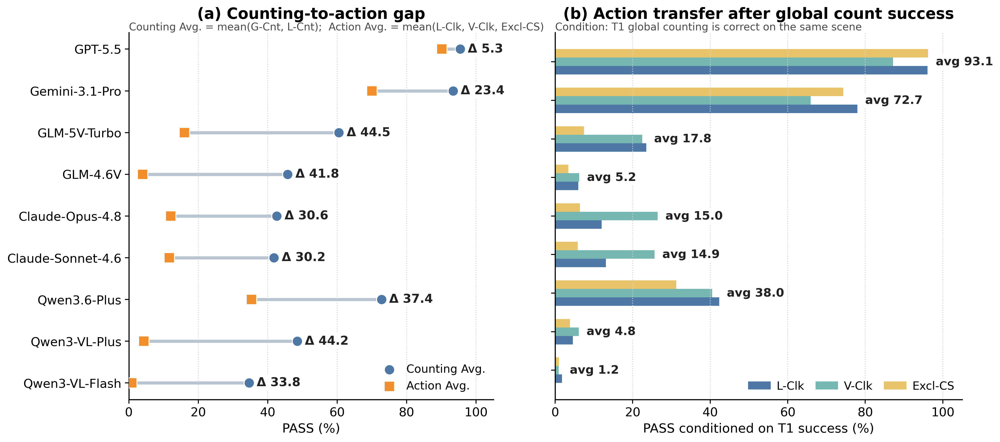

<div align="center">

# ROSE: Benchmarking the Perception-to-Action Gap in Multimodal Models

### Reference-conditioned Oddity and Symbolic Execution

**Can a multimodal model preserve a correct visual interpretation and turn it into the right action when the task context changes?**

[](https://arxiv.org/abs/XXXX.XXXXX)
[](https://huggingface.co/datasets/sysuwyh357/ROSE-v0.1)
[](LICENSE)
[](https://www.python.org/)

<!-- Replace the arXiv placeholder once the paper is public. -->

</div>

<p align="center">
  
</p>

> [!NOTE]
> The Hugging Face dataset is currently private during release preparation.  
> Authenticate with `hf auth login` before running the examples below. This note can be removed once the dataset is public.

---

## Overview

Multimodal large language models are increasingly expected not only to **recognize** visual content, but also to **act** on it. A model may correctly identify or count visually unusual elements while still failing to select the correct cells, respect a region constraint, abstain when no action is needed, or produce an exact symbolic response.

ROSE isolates this transition in a controlled setting. Each scene contains a grid of visually similar elements with a small number of exceptions. The target identity is never named explicitly: the model must infer the majority reference, identify the exception set, bind that set to the current task context, and return an exact formal action.

The same visual scene is reused across multiple coupled tasks, allowing ROSE to measure whether a visual interpretation survives changes in:

- the relevant region;
- the required output operation;
- the need to count, click, exclude, or abstain;
- the requirement for exact click-count consistency.

ROSE contains **1,512 scenes**, **3,024 images**, and **7,560 task instances** across five fine-grained visual sources. The official split contains **2,000 development** and **5,560 test** instances, with all tasks from the same scene assigned to the same split.

---

## Why ROSE?

| Property | What it enables |
|---|---|
| **Scene-coupled evaluation** | Compare perception and action on the same underlying visual evidence. |
| **Implicit visual reference** | Prevent shortcutting through an explicitly named target class. |
| **Context-conditioned regions** | Test whether models correctly filter the inferred exception set. |
| **Exact symbolic actions** | Separate plausible explanations from executable decisions. |
| **Diagnostic controls** | Distinguish perception, coordinate grounding, region binding, and protocol failures. |

---

## Benchmark Design

### Five visual sources

| Subset | Visual variation | Description |
|---|---|---|
| `ROSE-ChineseGlyph` | Glyph shape | Visually confusable Chinese characters rendered with a verified font pool. |
| `ROSE-EmojiStyle` | Rendering style | The same emoji identity shown in different visual styles. |
| `ROSE-EmojiContent` | Emoji identity | Visually related emoji contents selected with similarity and category controls. |
| `ROSE-PixelEdit` | Local pixel edit | Manually verified local edits within the same pixel-art image. |
| `ROSE-PixelContent` | Pixel-art content | Visually related but semantically different pixel-art assets. |

### Five coupled task templates

| Template | Task | Region/context | Required output |
|---|---|---|---|
| `T1_COUNT_GLOBAL` | Global counting | Whole grid | `COUNT(n)` |
| `T2_COUNT_LOCAL_NUMERIC` | Local counting | Row range, column range, or rectangle | `COUNT(n)` |
| `T3_CLICK_LOCAL_NUMERIC` | Local clicking | Numerically specified region | `CLICK(...); DONE` |
| `T4_CLICK_VISUAL_REGION` | Visual-region clicking | Highlighted region in the image | `CLICK(...); DONE` |
| `T5_CLICK_COUNT_EXCLUSION` | Exclusion action | Outside a text-specified excluded region | `CLICK(...); SUBMIT(n)` |

### Output grammar

ROSE uses an automatically verifiable symbolic protocol:

```text
COUNT(n)
CLICK(Rr,Cc); ...; DONE
CLICK(Rr,Cc); ...; SUBMIT(n)
```

Rows and columns are 1-indexed. Click order is ignored, but the predicted coordinate set must match exactly. Invalid coordinates, duplicate clicks, malformed outputs, and inconsistent click-count submissions are strict failures.

---

## Dataset Statistics

| Subset | Scenes | Images | Dev tasks | Test tasks |
|---|---:|---:|---:|---:|
| ChineseGlyph | 412 | 824 | 555 | 1,505 |
| EmojiStyle | 300 | 600 | 395 | 1,105 |
| EmojiContent | 300 | 600 | 395 | 1,105 |
| PixelEdit | 300 | 600 | 395 | 1,105 |
| PixelContent | 200 | 400 | 260 | 740 |
| **Total** | **1,512** | **3,024** | **2,000** | **5,560** |

---

## Key Results

ROSE is highly solvable by humans but remains challenging for current multimodal models. Human performance reaches **98.8% average PASS**, while model performance ranges from **14.3% to 92.2%**.

### Main benchmark results

| Model | Avg. PASS | Avg. SOFT | VALID |
|---|---:|---:|---:|
| Qwen3-VL-Flash | 14.3 | 31.0 | 86.6 |
| Qwen3-VL-Plus | 22.0 | 40.5 | 95.5 |
| Qwen3.6-Plus | 50.3 | 67.7 | 99.9 |
| Claude-Sonnet-4.6 | 23.7 | 36.9 | 61.3 |
| Claude-Opus-4.8 | 24.3 | 37.4 | 62.7 |
| GLM-4.6V | 20.7 | 41.3 | 98.8 |
| GLM-5V-Turbo | 33.8 | 54.5 | 99.5 |
| Gemini-3.1-Pro | 79.4 | 82.0 | 93.4 |
| GPT-5.5 | 92.2 | 94.6 | 100.0 |
| Human | 98.8 | 99.7 | - |

`PASS` requires exact task success. `SOFT` gives partial credit for approximate count or click-set quality. `VALID` is the grammar-valid output rate.

### Perception-to-action gap

<p align="center">
  
</p>

Across current models, counting-oriented performance is consistently stronger than region-conditioned action. The largest observed drop is **44.5 percentage points**. The gap remains even when action tasks are evaluated only on scenes where the same model already solves global counting correctly.

Representative task-level results:

| Model | G-Cnt | L-Cnt | L-Clk | V-Clk | Excl-CS | C-F1 | R-OK |
|---|---:|---:|---:|---:|---:|---:|---:|
| Qwen3.6-Plus | 80.3 | 65.3 | 39.5 | 37.7 | 28.9 | 50.7 | 68.9 |
| Gemini-3.1-Pro | 92.8 | 93.9 | 75.4 | 64.2 | 70.4 | 71.5 | 89.4 |
| GPT-5.5 | 93.8 | 97.0 | 93.6 | 84.3 | 92.5 | 92.0 | 98.2 |
| Human | 99.9 | 100.0 | 98.8 | 97.7 | 95.8 | 99.5 | 99.9 |

### The gap is not only coordinate grounding

The global-click bridge inserts a task between global counting and region-conditioned clicking:

```text
G-Cnt  ->  G-Clk  ->  V-Clk
count      global      region-conditioned
           coordinates coordinates
```

| Model | G-Cnt | G-Clk | G-Clk given G-Cnt correct | V-Clk | Card-Exact | Loc.-Exact given Card |
|---|---:|---:|---:|---:|---:|---:|
| Qwen3.6-Plus | 80.3 | 67.1 | 73.1 | 37.7 | 86.0 | 78.0 |
| Gemini-3.1-Pro | 92.8 | 86.5 | 90.5 | 64.2 | 91.2 | 94.8 |
| GPT-5.5 | 93.8 | 91.8 | 96.1 | 84.3 | 94.9 | 96.7 |

Coordinate grounding explains part of the loss, but the larger degradation often appears only after a region context is introduced.

### Correct local counting does not always transfer to exact action

The matched local-count bridge uses the **same image, same numeric region, and same target set** as the paired local-click task; only the output operation changes.

| Model | mL-Cnt | L-Clk | L-Clk given correct mL-Cnt | Transfer failure |
|---|---:|---:|---:|---:|
| Qwen3.6-Plus | 63.2 | 39.5 | 52.7 | 47.3 |
| GPT-5.5 | 71.6 | 93.6 | 95.5 | 4.5 |

For Qwen3.6-Plus, correct local cardinality frequently fails to survive the transition to exact action, especially in zero-target regions where the correct behavior is to abstain.

### Qualitative failures

<p align="center">
  
</p>

ROSE exposes several recurring action-level failure modes:

- **count anchoring**: preserving the global count after the task context changes;
- **region ignored**: clicking globally odd cells outside the valid region;
- **failure to abstain**: producing clicks when the correct action is empty;
- **one-cell shift**: predicting the correct cardinality but incorrect coordinates;
- **action-set expansion**: expanding a small target set into a larger local block.

---

## Repository Structure

```text
ROSE-v0.1/
├── README.md
├── LICENSE
├── requirements.txt
├── demo/
│   ├── run_qwen.py
│   ├── evaluate_rose.py
│   └── outputs/                      # generated files; ignored by Git
└── analysis/
    ├── README.md
    ├── rose_analysis_utils.py
    ├── analyze_scene_consistency.py
    ├── evaluate_global_click_bridge.py
    ├── evaluate_matched_local_count_bridge.py
    └── data/
        ├── global_click/
        │   └── metadata_test.jsonl
        └── matched_local_count/
            └── metadata_test.jsonl
```

The two derived bridge tasks are released as **metadata only**. Their image paths point to the canonical images in the main Hugging Face dataset, so no image files are duplicated in this repository.

---

## Installation

```powershell
git clone <YOUR_GITHUB_REPOSITORY_URL>
cd ROSE-v0.1
pip install -r requirements.txt
```

For private Hugging Face access during release preparation:

```powershell
hf auth login
```

---

## Quick Start

### 1. Run Qwen on a 50-example sample

The command below samples 10 instances from each visual subset:

```powershell
python .\demo\run_qwen.py `
  --repo_id "sysuwyh357/ROSE-v0.1" `
  --split test `
  --subsets all `
  --samples_per_subset 10 `
  --shuffle `
  --seed 42 `
  --model qwen3.6-plus `
  --api_key "YOUR_DASHSCOPE_API_KEY" `
  --temperature 0 `
  --max_tokens 256 `
  --disable_thinking `
  --output ".\demo\outputs\qwen36plus_test_50.jsonl"
```

The runner downloads only the metadata and images needed for the selected examples. To use a local dataset copy instead, add:

```text
--dataset_root "PATH_TO_LOCAL_ROSE-v0.1-hf"
```

### 2. Evaluate predictions

```powershell
python .\demo\evaluate_rose.py `
  --dataset_root "PATH_TO_LOCAL_ROSE-v0.1-hf" `
  --predictions ".\demo\outputs\qwen36plus_test_50.jsonl" `
  --split test `
  --out_dir ".\demo\outputs\eval_qwen36plus_test_50" `
  --allow_partial
```

Use `--allow_partial` only when evaluating a sampled subset. Remove it for a complete official split.

The evaluator produces:

```text
per_item_eval.jsonl
error_cases.jsonl
evaluation_summary.json
summary_by_subset.csv
summary_by_template.csv
table1_row.txt
table2_row.txt
```

### 3. Run the complete test split

Remove:

```text
--samples_per_subset 10
--shuffle
--seed 42
```

and omit `--allow_partial` during evaluation.

---

## Derived Bridge Analyses

The derived metadata files are stored in GitHub, while all images are reused from the main Hugging Face dataset.

<details>
<summary><b>Global-click bridge</b></summary>

Run inference:

```powershell
python .\demo\run_qwen.py `
  --metadata_path ".\analysis\data\global_click\metadata_test.jsonl" `
  --repo_id "sysuwyh357/ROSE-v0.1" `
  --split test `
  --subsets all `
  --samples_per_subset 10 `
  --shuffle `
  --seed 42 `
  --model qwen3.6-plus `
  --api_key "YOUR_DASHSCOPE_API_KEY" `
  --temperature 0 `
  --max_tokens 256 `
  --disable_thinking `
  --output ".\demo\outputs\qwen36plus_global_click_test_50.jsonl"
```

Evaluate and pair with the original main-task results:

```powershell
python .\analysis\evaluate_global_click_bridge.py `
  --dataset_root ".\analysis\data\global_click" `
  --predictions ".\demo\outputs\qwen36plus_global_click_test_50.jsonl" `
  --split test `
  --main_eval ".\demo\outputs\eval_qwen36plus_main\per_item_eval.jsonl" `
  --main_model qwen3.6-plus `
  --model qwen3.6-plus `
  --out_dir ".\demo\outputs\eval_qwen36plus_global_click_test_50" `
  --allow_partial
```

</details>

<details>
<summary><b>Matched local-count bridge</b></summary>

Run inference:

```powershell
python .\demo\run_qwen.py `
  --metadata_path ".\analysis\data\matched_local_count\metadata_test.jsonl" `
  --repo_id "sysuwyh357/ROSE-v0.1" `
  --split test `
  --subsets all `
  --samples_per_subset 10 `
  --shuffle `
  --seed 42 `
  --model qwen3.6-plus `
  --api_key "YOUR_DASHSCOPE_API_KEY" `
  --temperature 0 `
  --max_tokens 256 `
  --disable_thinking `
  --output ".\demo\outputs\qwen36plus_matched_local_count_test_50.jsonl"
```

Evaluate and pair with the original local-click results:

```powershell
python .\analysis\evaluate_matched_local_count_bridge.py `
  --dataset_root ".\analysis\data\matched_local_count" `
  --predictions ".\demo\outputs\qwen36plus_matched_local_count_test_50.jsonl" `
  --split test `
  --main_eval ".\demo\outputs\eval_qwen36plus_main\per_item_eval.jsonl" `
  --main_model qwen3.6-plus `
  --model qwen3.6-plus `
  --out_dir ".\demo\outputs\eval_qwen36plus_matched_local_count_test_50" `
  --allow_partial
```

</details>

<details>
<summary><b>Same-scene consistency analysis</b></summary>

This analysis requires no additional API calls:

```powershell
python .\analysis\analyze_scene_consistency.py `
  ".\demo\outputs\eval_qwen36plus_main\per_item_eval.jsonl" `
  --split test `
  --out_dir ".\demo\outputs\scene_consistency"
```

</details>

More details are available in [`analysis/README.md`](analysis/README.md).

---

## Metrics

| Metric | Definition |
|---|---|
| `PASS` | Exact task success under the formal protocol. |
| `SOFT` | Partial credit based on count error or click-set overlap. |
| `VALID` | Grammar-valid output rate. |
| `C-F1` | Strict click-set F1 over click-applicable tasks. |
| `R-OK` | Fraction of click predictions with no region-rule violation. |
| `Card-Exact` | Predicted click cardinality exactly matches the target cardinality. |
| `Action Ret.` | Mean action PASS after conditioning on correct global counting. |

---

## Figure Assets

The README expects the following exported paper figures:

```text
assets/
└── figures/
    ├── rose_overview.png
    ├── perception_action_gap.png
    └── qualitative_failures.png
```

Recommended exports:

| README image | Paper source | Suggested format |
|---|---|---|
| `rose_overview.png` | Figure 1 | PNG or SVG, full width |
| `perception_action_gap.png` | Figure 2 | PNG or SVG, full width |
| `qualitative_failures.png` | Figure 8 | PNG, full width |

Optional additional figures that work well in a project page:

```text
assets/figures/scene_consistency.png
assets/figures/subset_template_heatmap.png
assets/figures/difficulty_scaling.png
```

For GitHub rendering, use a white background and export raster figures at roughly 1,800-2,400 pixels wide.

---

## Data Access

- **Dataset:** [Hugging Face - sysuwyh357/ROSE-v0.1](https://huggingface.co/datasets/sysuwyh357/ROSE-v0.1)
- **Paper:** [arXiv - coming soon](https://arxiv.org/abs/XXXX.XXXXX)
- **Derived metadata:** [`analysis/data/`](analysis/data/)
- **Generated predictions and evaluations:** `demo/outputs/` (ignored by Git)

---

## Citation

Please cite ROSE if you use the benchmark, evaluator, or derived analyses.

```bibtex
@article{rose2026,
  title   = {ROSE: Benchmarking the Perception-to-Action Gap in Multimodal Models},
  author  = {TODO: Author List},
  journal = {arXiv preprint arXiv:XXXX.XXXXX},
  year    = {2026}
}
```

<!-- Replace the author list and arXiv identifier after public release. -->

---

## License

This repository is released under the [MIT License](LICENSE).

Dataset assets may retain the terms of their original sources. Please consult the dataset card and source-specific metadata before redistribution or commercial use.

---

## Acknowledgements

ROSE uses curated Chinese glyphs, public emoji renderings, and web-collected pixel-art assets to construct controlled fine-grained visual scenes. We thank the maintainers of the underlying visual resources and the developers of the evaluated multimodal models.

---

<div align="center">

**ROSE turns visual recognition into an exact test of whether models can preserve, rebind, and execute what they see.**

</div>
